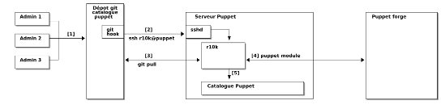

# Puppet Project

Ce projet Puppet est conçu pour automatiser la gestion de votre infrastructure en utilisant les meilleures pratiques de Puppet, notamment les rôles, les profils, et la gestion des données avec Hiera. Il est structuré pour être modulaire, maintenable et facile à étendre.



## Structure du projet

Le projet est organisé comme suit:
```bash
puppet-projet/
├── environments
│   └── production
│       ├── hiera.yaml                         # Configuration hiérarchique propre à l’environnement
│       └── manifests
│           └── site.pp                        # Point d’entrée du catalogue (inclut les rôles)
├── hieradata                                  # Données Hiera globales
│   ├── common.yaml
│   └── nodes
│       └── vm_preprod1.yaml
├── img
│   ├── img.png
│   ├── PE.jpeg
│   └── planning2.png
├── modules
│   ├── common                                  # Module commun regroupant des définitions génériques
│   └── role                                    # Module de rôles (role::backupserver, etc.)
│       ├── manifests
│       │   └── backupserver.pp
│       └── profile                             # Module de profils (configuration fonctionnelle)
│           ├── files                           # Fichiers de configuration éventuels
│           │   └── sshd_config.erb
│           ├── manifests
│           │   ├── backupserver.pp
│           │   ├── base.pp
│           │   └── server
│           │       └── physical.pp
│           └── spec                             # Dossier pour les tests unitaires. ✅
│               ├── classes
│               │   └── base_spec.rb
│               ├── fixtures
│               │   ├── hieradata
│               │   │   └── common.yaml
│               │   └── hiera.yaml
│               └── spec_helper.rb
├── .github/workflows/puppet-ci-cd.yml          # Pipeline CI/CD Github Action
├── Puppetfile                                  # Déclaration des dépendances de modules
├── r10k.yaml                                   # Configuration de r10k pour le déploiement automatisé
└── README.md                                   # Documentation et instructions d’utilisation
```


## Fonctionnalités

- **Gestion des rôles et profils**: Les rôles définissent le but d'un nœud (ex. `role::backupserver`), tandis que les profils configurent des services spécifiques (ex. `profile::base`, `profile::backupserver`).
- **Utilisation de Hiera**: Les données de configuration sont gérées via Hiera, permettant une séparation claire entre le code et les données.
- **Déploiement automatisé avec r10k**: Le projet utilise r10k pour déployer automatiquement les environnements à partir d'un dépôt Git.
- **Modules externes**: Les modules externes nécessaires sont déclarés dans le `Puppetfile` et gérés par r10k.

## Prérequis

- **Puppet**: Version 5 ou supérieure.
- **r10k**: Pour le déploiement automatisé des environnements.
- **Git**: Pour la gestion des versions du projet.

## Installation

1. **Cloner le dépôt**
   ```bash
   git clone git@github.com:/batchayw/puppet-project.git # Penser a modifier en fonction de votre git user-utiliseur
   cd puppet-project
   ```

2. **Installer les dépendances avec r10k** 
   ```bash
   r10k puppetfile install
   ```

3. **Déployer les environnements**
   ```bash
   r10k deploy environment -p
   ```

## Utilisation

- **Configuration des nœuds**

    - **site.pp**: Le fichier `site.pp` dans `environments/production/manifests/` est le point d’entrée du catalogue Puppet. Il assigne des rôles aux nœuds.
        ***Exemple:***
        ```puppet
        node 'vm_preprod1' {
            include role::backupserver
        }
        ```

- **Données Hiera** 

    - **common.yaml**: Contient les données globales applicables à tous les nœuds.
    - **nodes/vm_preprod1.yaml**: Contient les données spécifiques au nœud `vm_preprod1`

- **Rôles et profils**

    - **Rôles**: Les rôles définissent le but d'un nœud. Par exemple, `role::backupserver` inclut les profils nécessaires pour configurer un serveur de sauvegarde.

    - **Profils**: Les profils configurent des services spécifiques. Par exemple, `profile::base` gère la configuration de base (utilisateurs, SSH, etc.).

    - ***Exemples***
        - Ajouter un nouveau rôle
        
            1. Créez un fichier dans `modules/role/manifests/` (ex: `webserver.pp`).
            2. Définissez le rôle en incluant les profils nécessaires:
            ```puppet
            class role::webserver {
                include profile::base
                include profile::apache
            }
            ```
            3. Assignez le rôle à un nœud dans `site.pp`:
            ```puppet
            node 'vm_web1' {
                include role::webserver
            }
            ```

        - Ajouter un nouveau profil

            1. Créez un fichier dans `modules/profile/manifests/` (ex: `apache.pp`).
            2. Définissez le profil en configurant les services nécessaires:
            ```puppet
            class profile::apache {
                include ::apache
            }
            ```
            3. Incluez le profil dans un rôle.

- **Déploiement automatisé**

    - **r10k**: À chaque modification dans le dépôt Git, r10k met à jour automatiquement les environnements Puppet.

## Contribution

Les contributions sont les bienvenues ! Pour contribuer:

- Forkez le projet.
- Créez une branche pour votre fonctionnalité (`git checkout -b feature/nouvelle-fonctionnalite`).
- Committez vos changements (`git commit -am 'Ajouter une nouvelle fonctionnalité'`).
- Poussez la branche (`git push origin feature/nouvelle-fonctionnalite`).
- Ouvrez une Pull Request.

## Auteurs

- ***William BATCHAYON*** - `@batchayw`

## Remerciements

- ***Puppet Labs*** pour les modules officiels.
- La communauté ***Puppet*** pour les bonnes pratiques partagées.
- ***Jonathan Schaeffer*** - `onathan.schaeffer@univ-grenoble-alpes.fr, OSU IUEM` à traver son travail ***"Puppet, mon meilleur ennemi"***.
- La communauté ***r10k*** pour l'outil et les bonnes pratiques partagées.

## Licence

Ce projet est sous licence MIT. Voir le fichier **LICENSE** pour plus de détails.